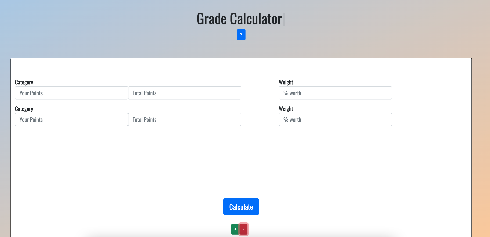

# Hello World!
[Jump to Who I Am: As a Person](#As-a-Person)

[Jump to Who I Am: As a Programmer](#As-a-Programmer)

---
## Who I Am
### As a Person


My name is **Ryan Truong** and I am a 4th year student at UCSD majoring in **Bioinformatics** with a minor in **Computer Science**. I was born in Los Angeles and moved to San Diego when I was very young, so I have basically lived in San Diego my whole life. 

When coming into UCSD, I originally wanted to take the premed route and eventually go to medical school, but during my second year I started taking some CS classes. Once taking these classes, I became super fascinated with programming and the field of computer science and decided to make the switch!

Outside of class I have a few hobbies which include:
- Hanging out with friends and finding good places to eat
- Watching [anime](#Motivational-Quote) and binging Netflix shows
- Playing basketball
- Playing video games

#### Motivational Quote
> Do you have time to waste looking down?
> -Tanaka Ryuunosuke (*Haikyu!!*)

### As a Programmer
My current interests lie in [Frontend Development](https://www.w3schools.com/howto/howto_blog_become_frontenddev.asp). This interest sparked when I made my [first web application](https://github.com/acmucsd-projects/team-piplup-wi22) with a team of UCSD students for a quarter-long project (used [MERN stack](MERN.png)). After working on the frontend for this project, I fell in love with working on the user interface side and having control of the artistic aspect and aesthetics.

```
# Useful/Fun CSS commands
margin-left
margin-right
position
background: linear-gradient()
```

Other Things I Have Worked On:




My top three languages that I currently use are:
1. [JavaScript](https://www.freecodecamp.org/learn/javascript-algorithms-and-data-structures/#basic-javascript)
2. [Java](https://ucsd-cse11-f21.github.io/)
3. [Python](https://www.py4e.com/)

*Included are hyperlinks that helped me learn these languages*

As for goals within software engineering I wish to:
- [x] Work in a job related to computer science
- [ ] Work as a Software Developer/Engineer
- [ ] Attempt to work for a big tech company

---
